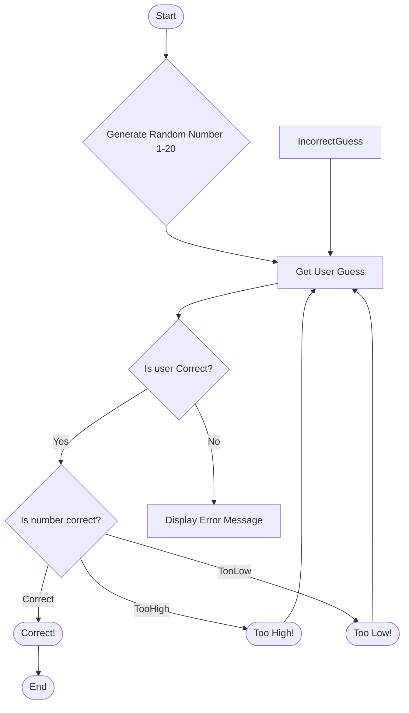

## Number Guessing Game

```mermaid
flowchart TD
Start([Start]) --> RandomNumber{Generate Random Number 1-20};
    RandomNumber --> UserGuess[Get User Guess];
    UserGuess --> CheckGuess{Is user Correct?};
    
    CheckGuess -- Yes --> Compare{Is number correct?};
    CheckGuess -- No --> IncorrectGUess[Display Error Message]
    IncorrectGuess --> UserGuess
    
    Compare -- Correct --> CorrectGuess([Correct!]);
    Compare -- TooHigh --> HighGuess([Too High!]);
    Compare -- TooLow --> LowGuess([Too Low!]);
    
    HighGuess --> UserGuess
    LowGuess --> UserGuess
    CorrectGuess --> End([End])
```
The game generates a random number.
The user then inputs their guess.
The game gives the user answers based on their guess.

